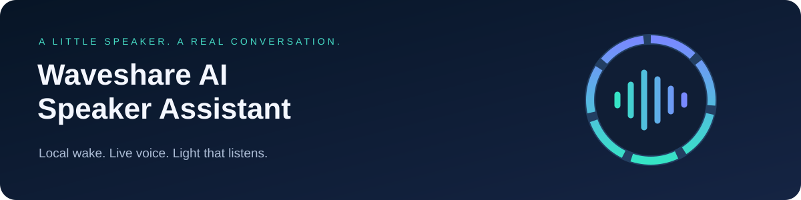

<div align="center">



# Waveshare AI Speaker Assistant

### Say “Jarvis.” Have a conversation. Say “Goodbye, Jarvis.”

A standalone, Wi-Fi voice assistant with local wake words and a ring of light that follows its voice.


**[Get the speaker ↗](https://amzn.to/3Tecbhp)** · **[First-time setup](docs/getting-started.md)** · **[Download firmware](https://github.com/KMX415/waveshare-ai-speaker-assistant/releases)**

<a href="https://amzn.to/3Tecbhp"></a>

<sub>Product photography is externally hosted and belongs to its respective owner. The maintainer-supplied product link may be an affiliate link.</sub>

</div>

---

## A little speaker. A real conversation.

| Feature | What you get |
|:--|:--|
| **Hands-free conversation** | Local “Jarvis” or “Computer” wake-word detection using Espressif WakeNet. |
| **Direct voice connection** | Audio streams over verified TLS to OpenAI GPT-Live-1. A computer is unnecessary after setup. |
| **Spoken hangup** | “Goodbye, Jarvis” ends the session and returns to wake listening. |
| **Light that follows the voice** | Wake flash, connection animation, listening state, and speaker-reactive LED meter. |
| **Browser-based setup** | Wi-Fi selection, API-key entry, volume, microphone gain, wake phrase, and sensitivity. |
| **Persistent settings** | Saved Wi-Fi and preferences; HMAC-backed encrypted API-key storage after explicit provisioning. |
| **USB-power simplicity** | Works from a USB power supply. No SD card required. |

**Status:** working hardware prototype. Spoken replies, local wake activation, repeated conversation starts/stops, and spoken hangup have been verified on the target board. This is an independent community project, not an official Waveshare or OpenAI product.

## Start here

**New speaker? Follow [the illustrated, step-by-step setup guide](docs/getting-started.md).** It covers everything from choosing the USB port to your first conversation, using a prebuilt firmware download.

You need:

- A **[Waveshare ESP32-S3-AUDIO-Board with speaker](https://amzn.to/3Tecbhp)**: 16 MB flash / 8 MB octal PSRAM.
- A USB **data** cable, a Windows PC for the documented first-time setup, and USB power for everyday use.
- A 2.4 GHz Wi-Fi network with internet access.
- Your own OpenAI API key, API billing, and access to the configured models.

The firmware selects `gpt-live-1`, voice `marin`, and `gpt-5.6-luna` as the Responses backend. Check model access before purchasing hardware solely for this project. A ChatGPT subscription does not itself provide API credits.

> **Before saving an API key:** a new board needs an explicit, one-time encrypted-storage provisioning step. This permanently uses hardware key slot 5. Ordinary flashing never performs that step. The [setup guide](docs/getting-started.md) explains it before asking you to proceed.

## How it feels


Say the wake word, wait for the ready tone, then speak. “Goodbye, Jarvis” remains the hangup phrase even when “Computer” is selected as the wake word.

| Light | Meaning |
|:--|:--|
| 🔹 Dim cyan dot | Waiting locally for the wake word |
| 🟢 Green flash | Wake word detected |
| 🟠 Moving amber | Connecting or closing |
| 🩵 Cyan ring | Live conversation is listening |
| 🔵 Blue level meter | Speaker playback; brightness and length follow the audio |
| 🔴 Blinking red for 3 seconds | Conversation error, then back to idle; check the setup page |

**BOOT:** short press starts/stops. Hold at least 2.5 seconds and release to reopen Wi-Fi setup. Holding BOOT while powering on enters download mode instead.

## Your audio and your credentials

Idle microphone audio stays on the device. During a live conversation, audio is sent to OpenAI. The firmware does not save recordings or transcripts; the legacy desktop client can optionally print transient transcripts.

The API key persists in encrypted NVS after provisioning. **Wi-Fi credentials and ordinary preferences use unencrypted NVS.** HMAC-backed key storage protects copied credential flash, but does not stop malicious replacement firmware: secure boot and whole-flash encryption are not enabled. See [SECURITY.md](SECURITY.md).

Conversations use paid API access, stop after 60 seconds of inactivity or 10 minutes total, and do not automatically restart after connection failures. Spoken hangup relies on the live input transcript; quoting the exact command can also hang up. BOOT works without transcription.

## What’s next

- [ ] Control remote Codex tasks and receive spoken progress updates.
- [ ] Smart-home actions, weather, reminders, and persistent memory.
- [ ] Adjustable LED brightness and themes.
- [ ] Broader acoustic, interruption, and long-duration testing.

These integrations are **not implemented yet**. Postal code can be saved, but no weather capability uses it.

## For builders

| Path | Purpose |
|:--|:--|
| [firmware/](firmware/) | ESP-IDF firmware, audio, wake words, LEDs, device portal, and key storage |
| [src/home_voice/](src/home_voice/) | PC setup UI, USB utilities, and legacy desktop voice bridge |
| [scripts/](scripts/) | Storage provisioning and explicitly invoked hardware checks |
| [tests/](tests/) | 35 host-side tests for protocol, audio, authentication, setup, and provisioning guards |
| [docs/standalone.md](docs/standalone.md) | Runtime details and diagnostics |
| [firmware/README.md](firmware/README.md) | Build from source with ESP-IDF v5.5.2 |

```powershell
.\setup.ps1
.\.venv\Scripts\python.exe -m unittest discover -s tests -q
```

Close the setup server before running hardware scripts: only one process can open the serial port. Test scripts currently use `COM14`; edit that for your board. `check_device_voice.py` and `check_voice_restart.py` start paid sessions. `check_wake_word.py` changes saved preferences—read it before running.

## Credits & license

Built on [ESP-IDF](https://github.com/espressif/esp-idf), [ESP-SR](https://github.com/espressif/esp-sr), and [OpenAI Live](https://developers.openai.com/api/docs/guides/voice-websockets?api=live), for [Waveshare’s audio board](https://docs.waveshare.com/ESP32-S3-AUDIO-Board).

Project source: **[MIT License](LICENSE)**. Dependencies, model assets, trademarks, and externally hosted photography retain their respective licenses and ownership.
